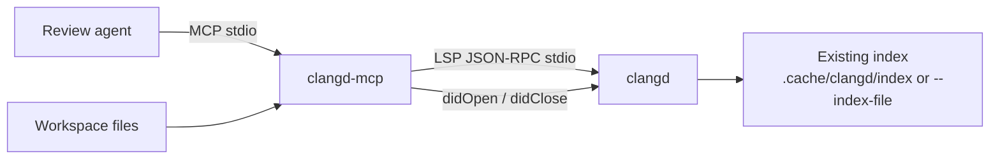

# clangd-mcp plan

An MCP server that talks to a **live clangd process** and exposes C++ semantic
queries as tools. The index is assumed to already exist (background-index
shards or a merged `--index-file`). This server does not build, parse, or diff
`.idx` files.

The goal is not another thin LSP mirror. Existing clangd MCP servers already
wrap `definition` / `references` / `workspace/symbol`. This one should be
**review-context first**: given a change (files, hunks, or a symbol list),
return the smallest structured neighborhood an agent needs to review it.

---

## Why clangd, not grep

Agent reviews of C++ fail in predictable ways when they only have text search:

- Overloads, templates, and macros do not match by name.
- A one-line signature change can have a blast radius across TUs.
- Virtual methods need implementations and derived types, not just call sites.
- A header-only change needs the paired `.cpp` and every includer.
- "Who tests this?" is usually an incoming-call / reference question.

clangd already answers these from the index. The MCP should package those
answers for agents: compact, structured, capped, and keyed so an external
index-diff pipeline can join later.

---

## Constraints

- **One clangd, one index.** The server is self-contained. It queries whatever
  clangd was started with. Comparing two indexes (regression A vs B, main vs
  PR) is done *outside* this MCP. The join keys we return (`usr`, clangd
  `id`, qualified name, definition location) are what those external diffs
  should emit.
- **Index is already built.** Startup should load existing
  `.cache/clangd/index` shards or a frozen `--index-file`. We do not wait
  to reindex the world.
- **No public "lookup by SymbolID" in LSP.** clangd can look up by
  `SymbolID` internally (`SymbolIndex::lookup`), but LSP only offers fuzzy
  `workspace/symbol` (by name) and position-based requests. External index
  diffs must therefore hand us **qualified names and/or file:line:col**, not
  only opaque IDs. We still *return* `usr` / `id` from
  `textDocument/symbolInfo` so those pipelines can correlate.
- **Agents have tiny context windows.** Tools must default to summaries
  (counts, top files, 1-hop neighbors) with optional expansion.

---

## Non-goals (v1)

- Parsing or diffing clangd RIFF/YAML index shards.
- Building or refreshing the project index.
- Running two clangd processes and synthesizing an inter-index diff.
- Code completion, rename, apply-edit, or format.
- Whole-TU AST dumps.
- Attaching to an already-running editor clangd (we spawn our own).
- Remote-index / clangd-index-server protocol.

---

## Architecture

Layers:

1. **Process manager** — spawn clangd with workspace root, compile-commands
   dir, and index flags. Restart on crash. Expose ready/health.
2. **LSP client** — Content-Length JSON-RPC, request IDs, notifications
   (`publishDiagnostics`, `clangd.fileStatus`, `inactiveRegions`).
3. **Document session** — before any position-based call: read file from
   disk, `didOpen`, wait until `fileStatus` is idle (or timeout). Close
   idle files so ASTs do not accumulate.
4. **Tool layer** — primitives (one or two LSP calls) and composites
   (review-oriented aggregations). All paths relative to workspace root.
   UTF-8 offsets negotiated with clangd.

Config (env and/or CLI, resolved at process start):

| Setting | Purpose |
| --- | --- |
| `CLANGD_MCP_WORKSPACE` | Project root (`rootUri`) |
| `CLANGD_MCP_CLANGD` | clangd binary (default `clangd`) |
| `CLANGD_MCP_COMPILE_COMMANDS_DIR` | `initializationOptions.compilationDatabasePath` |
| `CLANGD_MCP_INDEX_FILE` | optional frozen `--index-file` |
| `CLANGD_MCP_CLANGD_ARGS` | extra flags |
| result caps | `max_results`, snippet lines, call-graph depth |

Recommended clangd flags: `--background-index` so existing shards load,
`--limit-references` left to us (we cap in the MCP), `--offset-encoding=utf-8`.

### Language

**TypeScript + official `@modelcontextprotocol/sdk`**, Node 20+, stdio
transport. MCP is specified around that SDK; Cursor / Claude Code config is
a one-line `npx`/`node` command. The LSP client is small and testable.

Python is a fine alternative if we want fewer JS toolchain bits. The tool
surface below does not depend on the language.

---

## Use cases

### 1. Agent code review (primary)

Input: a PR diff or a list of touched files/hunks.
Output: the symbols in those hunks, what they are, who calls them, who
implements them, which other files are in the blast radius, and any
diagnostics on the touched TUs.

This is the reason the server exists. An agent should be able to call
**one** composite tool and get enough structure to write a review, then
drill in with primitives only when something looks wrong.

### 2. Blast radius / API-break detection

"If this virtual method or free function changes shape, what else must
change?" Incoming calls, references grouped by file, implementations,
derived types. Useful for reviewers and for agents proposing refactors.

### 3. Finding the tests that cover a change

Incoming calls and references whose paths look like tests (`*test*`,
`*_test.cpp`, `unittests/`). Reviewers often miss that a helper is only
tested indirectly.

### 4. Header/source and include pairing

A diff that only touches `Foo.h` still needs `Foo.cpp` and the main
includers. `switchSourceHeader` plus reference summaries on the header's
primary symbols.

### 5. Inheritance and override review

Changing a base class, a virtual, or a type used as a template argument.
Type hierarchy (bases + derived) and `textDocument/implementation` catch
what grep cannot.

### 6. Template / overload / macro-aware navigation

Position-based definition, hover, and AST-on-range. Agents stop guessing
which overload a call binds to.

### 7. Onboarding and "what is this symbol?"

Hover + definition snippet + qualified name + USR + a short reference
summary. Good for agents answering questions, not only reviewing diffs.

### 8. Dead or suspiciously unused API

Reference counts near 1 (declaration/definition only) on a symbol in the
diff. A hint, not a proof (macros and out-of-index TUs exist).

### 9. Diagnostics as review signal

`publishDiagnostics` for every file in the change. New errors/warnings are
often the cheapest "this PR is wrong" signal.

### 10. Joining an *external* index-diff (regression / evolution)

An outside job diffs two clangd indexes (or two `--index-file` dumps) and
produces added / removed / changed symbols as `{name, usr?, id?, location?}`.
This MCP then explains the **current** index side: definition, owners,
callers, hierarchy. Evolution narratives ("this type gained three derived
classes") are composed by the agent from (external delta) + (live queries).

The MCP stays self-contained: it never opens the other index.

### 11. Reviewing generated or ABI-sensitive code

Hover and a bounded AST range show deduced types, implicit conversions, and
record layout clues without dumping the TU.

### 12. "Which extra files should a human open?"

A derived file list: paired headers/sources, files with the most incoming
calls, files that implement a changed interface. This is a ranking problem
on top of the same primitives.

---

## Tools

Two tiers. Composites are the product. Primitives exist so an agent can
zoom in without us inventing a new mega-tool for every question.

Every tool that resolves a concrete symbol should include, when clangd
provides it:

- `name`, `containerName`, `kind`
- `usr`, `id` (from `textDocument/symbolInfo`)
- `declaration` / `definition` locations
- workspace-relative paths, 0-based line/character (UTF-8)

Hard default caps (overridable per call): `max_symbols=40`,
`max_refs=50`, `max_callers=30`, `snippet_lines=3`, `call_depth=1`.

### Composite tools (build first)

#### `review_context`

The main tool.

**Input**

- `files`: `{ path, ranges?: [{start_line, end_line}] }[]`
- **or** `unified_diff`: a standard unified diff (parsed internally)
- `include_diagnostics?: bool` (default true)
- `include_callers?: bool` (default true)
- caps as above

**Work**

1. Normalize to file + line ranges.
2. `didOpen` each file; `documentSymbol`.
3. Keep symbols whose range overlaps a hunk. If a file has no ranges, keep
   top-level symbols only (do not explode a 5k-line file).
4. For each kept symbol, at `selectionRange` start:
   - `symbolInfo`
   - hover (truncated)
   - `references` with `container` capability → **summary**: total count,
     counts by file, top N locations with optional snippets
   - incoming calls (depth 1) if it looks like a function
   - implementations if it looks like a class / virtual
   - type hierarchy (parents + children, depth 1) if it looks like a type
   - paired header/source via `switchSourceHeader`
5. Diagnostics for opened files.
6. A `blast_radius` section: extra files ranked by ref/call count, plus
   paired headers/sources not in the original diff.

**Output** — compact JSON, not prose. The agent writes the review.

#### `symbol_impact`

Same neighborhood as above for **one** symbol, addressed by:

- `path` + `line` + `character`, or
- `query` (workspace symbol search; require a unique match or return
  candidates)

Use when the agent already knows the interesting symbol.

#### `symbols_in_range`

Map hunks → overlapping `documentSymbol` entries (name, kind, range,
container). Cheap first step if `review_context` is too heavy or the agent
wants to filter before impact analysis.

#### `explain_symbol`

Hover + definition snippet + `symbolInfo` + 1-line signature. The "what is
this?" tool. No reference crawl unless `include_summary=true`.

### Primitive tools

| Tool | LSP | Notes |
| --- | --- | --- |
| `search_symbols` | `workspace/symbol` | Fuzzy name search. Support `::` scope hints the way clangd does. |
| `get_symbol_info` | `textDocument/symbolInfo` | USR + clangd id. Join key for external index diffs. |
| `get_hover` | `textDocument/hover` | Type + comments. Truncate. |
| `get_definition` | `textDocument/definition` | |
| `get_declaration` | `textDocument/declaration` | |
| `get_type_definition` | `textDocument/typeDefinition` | Useful for `auto` / typedefs. |
| `find_references` | `textDocument/references` | Enable `textDocument.references.container`. Return grouped summary by default; `expand=true` for full list. |
| `find_implementations` | `textDocument/implementation` | Virtuals and interfaces. |
| `get_callers` | `prepareCallHierarchy` + `incomingCalls` | `depth` default 1. |
| `get_callees` | `prepareCallHierarchy` + `outgoingCalls` | Same. |
| `get_type_hierarchy` | `prepareTypeHierarchy` + super/sub | `direction`: parents, children, both. |
| `get_file_symbols` | `textDocument/documentSymbol` | File outline. |
| `get_diagnostics` | stored `publishDiagnostics` | Per file or all open. |
| `switch_source_header` | `textDocument/switchSourceHeader` | |
| `get_ast` | `textDocument/ast` | **Range required**, depth-capped. Never a whole file. |
| `clangd_status` | fileStatus + initialize result | Ready?, open files, clangd version, index mode. |

### Intentionally omitted (v1)

- `completion` — not a review tool.
- `rename` / `codeAction` / `formatting`.
- `inlayHints` / `semanticTokens` / `inactiveRegions` as tools (we may
  *consume* inactive regions later to mark `#if 0` hunks).
- `$/memoryUsage` — debug-only; maybe behind `clangd_status(verbose)`.

---

## Example agent flow

Review a PR that changes `src/sema/CheckCall.cpp` and `include/sema/Call.h`:

1. `review_context` with the unified diff.
2. Read `blast_radius` and `symbols[].reference_summary`.
3. If a virtual looks dangerous → `get_type_hierarchy` + `find_implementations`.
4. If a free function looks widely used → `get_callers` with `depth=2` on
   that symbol only.
5. Write the review from the structured JSON, not from grepping the repo.

External index-diff flow (outside this repo):

1. Diff two indexes → `{added, removed, changed}` with name + location.
2. For each changed symbol, `explain_symbol` or `symbol_impact` against
   **this** clangd (the "after" tree).
3. Agent narrates evolution. This MCP never saw the "before" index.

---

## Operational details

**Readiness.** clangd is not useful until the workspace initialize handshake
finishes and, for a given file, the preamble/AST is built. `review_context`
must wait on `textDocument/clangd.fileStatus` (enable
`initializationOptions.clangdFileStatus`) rather than firing LSP requests
into a cold TU.

**didOpen cost.** Opening many TUs is the expensive part. Batch unique files
from the diff, open them, query, then close. Do not keep the whole project
open.

**Wrong compile command.** If `compile_commands.json` is missing or points
at another build, every result is junk. Fail fast in `clangd_status` /
startup if the CDB path does not exist.

**Result hygiene.** Never return raw multi-thousand reference lists. Always
counts + top-N. Snippets are opt-in. This matters more than adding more
tools.

**Concurrency.** One clangd stdio socket: serialize LSP requests, allow
concurrent MCP tool calls to queue. Composites should issue their LSP
calls sequentially per file, files can be pipelined carefully later.

**Security / sandbox.** The server reads workspace files and starts a
subprocess. It should not take arbitrary shell, and paths must stay under
the workspace root (after realpath).

---

## Implementation phases

### Phase 0 — this document

Agree on use cases and the tool list before writing code.

### Phase 1 — skeleton

- Package, stdio MCP server, clangd spawn + initialize.
- Document session (`didOpen` / `didClose` / fileStatus wait).
- `clangd_status`, `search_symbols`, `get_file_symbols`, `get_hover`,
  `get_definition`, `find_references` (with container + grouping).

### Phase 2 — review composites

- `symbols_in_range`, `explain_symbol`, `symbol_impact`, `review_context`
  (including unified-diff parse).
- Call hierarchy, implementations, type hierarchy, diagnostics,
  switch header.
- `usr` / `id` on every resolved symbol.

### Phase 3 — polish

- Caps, snippets, blast-radius ranking, test-path heuristic.
- `get_ast` (bounded).
- Integration tests against a tiny C++ fixture + a recorded/mocked LSP
  for unit tests.
- README: Cursor / Claude Code MCP config.

Tests do not require a huge project. A fixture with a base class, a
virtual, two derived classes, a free function, and a test file is enough
to lock the composites.

---

## Open questions

1. **TypeScript vs Python** — plan assumes TypeScript. Easy to flip before
   Phase 1 if you prefer Python.
2. **Should `review_context` accept a raw `git diff` on stdin-style
   `unified_diff`, or only structured `files[]`?** Both is cheap; structured
   is enough if the agent already parsed the patch.
3. **Frozen `--index-file` as a first-class mode** for regression
   machines, vs only background-index shards. I would support both in
   config from day one (it is just a clangd argv flag).
4. **Do we ever want a second clangd** (before/after) inside this process?
   I would not. It breaks "self-contained" and doubles memory. Run two MCP
   instances if you need two indexes.
5. **Lookup-by-USR:** if you control the clangd you talk to, a tiny custom
   LSP extension (`clangd/lookup` by `id` / `usr`) would make external
   index-diff joins exact. That is a clangd change, not this repo. Worth
   it only if name+location collision becomes real.

---

## What success looks like

An agent, given only a C++ diff and this MCP, can answer:

- Which symbols did this change actually touch?
- Who calls them, who implements them, and which types sit above/below?
- Which extra files (paired TU, tests, derived classes) a reviewer should
  open?
- Are there compile diagnostics on the touched files?

…without reading the clangd index format and without dumping half the
repository into the prompt.
