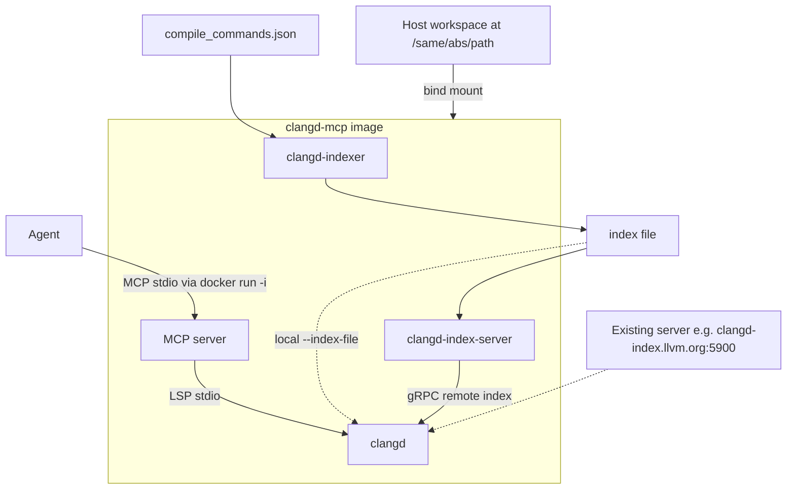

# clangd-mcp plan

An MCP server that is a **thin interface from agents to clangd**, delivered
as a **container**. The image includes clangd, `clangd-indexer`, and
`clangd-index-server`. The same image **builds** a static index, optionally
**hosts** it over clangd's remote-index gRPC API, and **serves** MCP
queries against a local file or a remote server.

The MCP tools themselves stay a clangd query interface. Review workflows,
diff parsing, and index-file comparison stay in the caller.

---

## Goal

Give agents project-wide C++ intelligence (symbols, xrefs, hover, call/type
hierarchy) over MCP, with a hermetic clangd stack.

The container:

1. **`index`** — run `clangd-indexer` on a `compile_commands.json` and write
   a static index file.
2. **`host`** — run `clangd-index-server` so that index is available over
   gRPC (the same remote-index stack LLVM uses at
   `clangd-index.llvm.org`).
3. **`serve`** — start the MCP server and a clangd that either loads the
   index file locally or connects to a remote index server, then expose
   clangd requests as tools.

It does **not** interpret git diffs, assemble review reports, or parse
index files by hand.

---

## Why this exists

Agents default to grep. That misses overloads, templates, macros, virtual
dispatch, and cross-TU references. clangd already answers those from an
index. This image is the clangd + indexer + MCP socket.

Typical *callers* (not built into the tools):

- A review agent that already has a diff and wants callers / implementations
  for symbols it resolved itself.
- A pipeline that diffs two index files elsewhere, then looks up names or
  locations here.
- Interactive exploration: "what is this type?", "who calls this?"

---

## Constraints

- **Container is the unit of delivery.** clangd, `clangd-indexer`, and
  `clangd-index-server` live in the image (same clangd GitHub release,
  which is remote-index enabled). Callers do not install clangd on the
  host.
- **Index build and index hosting are container commands, not MCP
  tools.** `docker run … index` writes the file; `docker run … host`
  serves it over gRPC; `docker run … serve` queries via clangd. The MCP
  tool list stays query-only.
- **One clangd, one index per serve process.** Comparing two indexes is
  two containers (or two serve invocations). `host` can be shared by
  many `serve` clients.
- **Paths stay as they are (v1).** clangd indexes store absolute paths.
  We do **not** rewrite `compile_commands.json`, source paths, or index
  URIs. Bind-mount the workspace (and anything the compile commands
  reference) at the **same absolute path** inside the container as on the
  host. Path remapping can come later if this becomes painful.
- **No LSP lookup by SymbolID / USR.** Callers join by name and/or
  `file:line:col`. Tools still return `usr` and clangd `id` from
  `textDocument/symbolInfo` when a position is available.
- **AST-backed vs index-backed.** Project-wide search, references, and
  call hierarchy come from the static index. Hover, document symbols,
  diagnostics, and AST still need `didOpen` plus a compile command for
  that file.

---

## Non-goals

- Review composites (hunk mapping, blast-radius ranking, test-path
  heuristics).
- Parsing unified diffs or git patches.
- Parsing or diffing clangd index files.
- Rewriting or relocating paths inside the index / compile database (v1).
- Completion, rename, apply-edit, format.
- Whole-TU AST dumps.
- Attaching to a host or editor clangd.

---

## Architecture



This is clangd's [remote index](https://clangd.llvm.org/design/remote-index.html)
split: indexer (batch) → index server (gRPC) → clangd client (in `serve`).
LLVM already runs that server for llvm-project at
[`clangd-index.llvm.org:5900`](https://clangd-index.llvm.org/). Chromium
has public servers too. We ship the same binaries and can either **host
our own** or **point clangd at an existing one**.

Three entrypoints, one image:

| Command | What it runs |
| --- | --- |
| `index` | `clangd-indexer` → static index file |
| `host` | `clangd-index-server <index> <project-root>` (gRPC, default port 50051; reloads when the file is overwritten) |
| `serve` | MCP stdio → child clangd with a local `--index-file` **or** `Index.External.Server` |

### Image contents

Pin a **clangd GitHub release** (e.g. 22.x) and install matching assets:

- `clangd-linux-*.zip` → `clangd` (GitHub builds include remote-index
  client support; official LLVM/distro clangd often does not)
- `clangd_indexing_tools-linux-*.zip` → `clangd-indexer` and
  `clangd-index-server`

(`clangd-indexer` and `clangd-index-server` are not in LLVM distro
packages; they are in the
[clangd/clangd](https://github.com/clangd/clangd/releases) indexing-tools
asset.)

Also ship a default C/C++ compiler (image `clang`/`gcc`) so projects whose
compile commands use `/usr/bin/c++` (or similar) can index without a host
toolchain. If the project's compile commands point at a **custom**
compiler path, bind-mount that path too. Same rule as sources: no rewrite.

The MCP process is the image `CMD` (`serve`). `index` and `host` are
explicit subcommands.

### Path rule (v1)

```text
host /home/me/proj     →  container /home/me/proj
host /opt/my-toolchain →  container /opt/my-toolchain   # only if CDB needs it
```

```bash
# Build the index (same image).
docker run --rm \
  -v /home/me/proj:/home/me/proj \
  clangd-mcp index \
    --compile-commands /home/me/proj/build/compile_commands.json \
    --output /home/me/proj/.clangd-mcp/index.idx

# Optional: host the index over gRPC (share across serve clients).
docker run --rm -p 50051:50051 \
  -v /home/me/proj:/home/me/proj \
  clangd-mcp host \
    --index-file /home/me/proj/.clangd-mcp/index.idx \
    --project-root /home/me/proj

# Serve MCP over stdio (local file).
docker run -i --rm \
  -v /home/me/proj:/home/me/proj \
  clangd-mcp serve \
    --workspace /home/me/proj \
    --index-file /home/me/proj/.clangd-mcp/index.idx

# Or serve against a remote index (ours, or LLVM's public one).
docker run -i --rm \
  -v /home/me/llvm:/home/me/llvm \
  clangd-mcp serve \
    --workspace /home/me/llvm \
    --remote-index clangd-index.llvm.org:5900
```

If `compile_commands.json` names `/home/me/proj/...` and the compiler
`/usr/bin/c++`, both must exist at those paths in the container. The first
comes from the bind mount; the second from the image (or another mount).

### `index` command

Thin wrapper around `clangd-indexer`, same version as the image clangd:

```text
clangd-indexer --executor=all-TUs <compile_commands.json> > <output>
```

Flags we expose: compile-commands path, output path, extra indexer args.
The output is a static RIFF/YAML index suitable for `--index-file` or
for `clangd-index-server`.

This is **not** an MCP tool. CI or a human runs `index` when the tree or
compile database changes.

### `host` command

Thin wrapper around `clangd-index-server`:

```text
clangd-index-server <index-file> <project-root>
```

Loads the index into memory and serves clangd's remote-index gRPC API
(default port 50051). The server reloads when the index file is
overwritten, so `index` can refresh without restarting `host`.

`--project-root` is the prefix the indexer used. The server strips it;
the clangd client puts `Index.External.MountPoint` back on. In v1 we
keep those two paths the same (no remapping). Later this is how
different checkout locations can share one hosted index.

`host` is also **not** an MCP tool. It is the same role as
[llvm-remote-index](https://github.com/clangd/llvm-remote-index):
index on a beefy machine, query from many clangd clients.

### `serve` command

1. Process manager starts clangd with `--background-index=false` and
   either:
   - **Local file:** `--index-file=<abs>`
   - **Remote index:** user-level clangd config written inside the
     container (remote index is [not allowed in project
     `.clangd`](https://clangd.llvm.org/design/remote-index.html) for
     privacy). Something like:
     ```yaml
     If:
       PathMatch: /home/me/proj/.*
     Index:
       External:
         Server: clangd-index.llvm.org:5900   # or host:50051
         MountPoint: /home/me/proj/
     ```
2. LSP client: Content-Length JSON-RPC, `publishDiagnostics`,
   `clangd.fileStatus`.
3. Document session: `didOpen` / wait idle / `didClose` for position-based
   calls.
4. Tool layer: one MCP tool ≈ one clangd request (or prepare/resolve).

`--background-index=false` matters for the local-file mode: the static
`clangd-indexer` file is not the same format as `.cache/clangd/index`
shards. We do not want a full reindex on first `didOpen`. Same flag
when using a remote server: the hosted index *is* the project index.

Config for `serve`:

| Setting | Purpose |
| --- | --- |
| workspace root | **Required.** LSP `rootUri`. |
| index file | Local static index (`--index-file`). Mutually exclusive with remote. |
| remote index | `host:port` for `Index.External.Server`. Mutually exclusive with index file. |
| mount point | Optional. Defaults to workspace root (v1: same path). |
| compile-commands dir | Optional `compilationDatabasePath`. |
| extra clangd args | Escape hatch. |
| result caps | Applied in the MCP. |

Exactly one of `index file` or `remote index` is required.

clangd binary path is internal to the image, not a user setting.

### Language / MCP transport

**TypeScript + official `@modelcontextprotocol/sdk`**, Node 20+, **stdio**
inside the container. Host agents use `docker run -i`. HTTP/SSE can wait
until someone needs a long-lived daemon.

---

## Tools

Each tool is a direct clangd capability. Light presentation only: paths
as clangd returned them (absolute, matching the index), UTF-8 positions,
default result caps, optional snippets. No cross-tool review assembly.

When a tool is position-based and the token resolves, include `name`,
`containerName`, `kind`, `usr`, `id` from `textDocument/symbolInfo` where
it is cheap.

Default caps (overridable per call): `max_results=50`, `snippet_lines=0`,
`call_depth=1`.

| Tool | clangd / LSP | Notes |
| --- | --- | --- |
| `search_symbols` | `workspace/symbol` | Fuzzy name search; `::` scope hints as clangd implements them. |
| `get_symbol_info` | `textDocument/symbolInfo` | USR + clangd `id` at a position. |
| `get_hover` | `textDocument/hover` | Truncate long markdown. |
| `get_definition` | `textDocument/definition` | |
| `get_declaration` | `textDocument/declaration` | |
| `get_type_definition` | `textDocument/typeDefinition` | |
| `find_references` | `textDocument/references` | Enable `textDocument.references.container`. Cap the list. |
| `find_implementations` | `textDocument/implementation` | |
| `get_callers` | `prepareCallHierarchy` + `incomingCalls` | `depth` default 1. |
| `get_callees` | `prepareCallHierarchy` + `outgoingCalls` | Same. |
| `get_type_hierarchy` | `prepareTypeHierarchy` + super/sub | `direction`: parents, children, both. |
| `get_file_symbols` | `textDocument/documentSymbol` | Outline of one file. |
| `get_diagnostics` | stored `publishDiagnostics` | Per opened file. |
| `switch_source_header` | `textDocument/switchSourceHeader` | |
| `get_ast` | `textDocument/ast` | Range required, depth-capped. |
| `clangd_status` | initialize + fileStatus | clangd version, index source (file vs remote address), ready?, open files. |

Omitted: `completion`, `rename`, `codeAction`, `formatting`, `inlayHints`,
`semanticTokens`, `inactiveRegions` as tools, `$/memoryUsage`, and any
`build_index` MCP tool.

---

## Example caller flow

1. Image built once (CI or local).
2. `docker run … index` on the project's `compile_commands.json`
   **or** skip this if a public/remote server already exists (LLVM,
   Chromium, or our own `host`).
3. Optionally `docker run … host` if we want to share that file over
   gRPC instead of loading it in every clangd.
4. Agent config points at `docker run -i … serve` with either
   `--index-file` or `--remote-index`.
5. Agent calls `search_symbols` / `get_definition` / `find_references` /
   `get_callers` / … as needed.

---

## Operational details

**Readiness.** After LSP initialize, wait until the index is usable
(local `--index-file` loads asynchronously; remote needs a successful
first index RPC). `clangd_status` reports when index-backed tools are
safe. For an opened file, wait on `textDocument/clangd.fileStatus`
before AST requests.

**didOpen.** Only files the tool needs. Close after idle.

**Compile database.** Fail clearly if an AST/position tool is called and
clangd has no compile command for that file. Index-only tools should
still work.

**Result hygiene.** Cap lists.

**Concurrency.** One clangd stdio socket inside the container; MCP tool
calls queue.

**Security.** Container entrypoint is `index`, `host`, or `serve` only.
No arbitrary host shell. Bind mounts are the caller's responsibility.
`host` exposes gRPC; do not publish it to the internet without the same
care LLVM uses on `clangd-index.llvm.org`. Remote-index config is
written only as **user** config inside the container, never into the
mounted project's `.clangd`.

**Resource.** `clangd-indexer` over a large CDB is CPU- and memory-heavy.
`host` keeps the whole index in memory (that is the point: one copy,
many clients). `serve` with `--index-file` also loads the index in
clangd; `serve` with `--remote-index` keeps clangd smaller.

---

## Implementation phases

### Phase 0 — this document

Container + bundled clangd/indexer; MCP remains query-only.

### Phase 1 — skeleton + image

- TypeScript MCP stdio server.
- clangd spawn with required `--index-file` and `--background-index=false`.
- Document session (`didOpen` / `didClose` / fileStatus wait).
- `clangd_status`, `search_symbols`, `get_hover`, `get_definition`,
  `find_references`.
- Dockerfile: pinned clangd + indexing-tools (indexer **and**
  index-server) + Node runtime.
- Image entrypoint: `index` | `host` | `serve`.
- `serve` supports `--index-file` first; `--remote-index` in the same
  phase if it stays a small config-file write.

### Phase 2 — remaining clangd tools

- Declaration, type definition, symbol info, document symbols.
- Implementations, callers, callees, type hierarchy.
- Diagnostics, switch header, bounded AST.

### Phase 3 — polish

- Caps, optional snippets, `usr`/`id` on resolved positions.
- Unit tests against a mocked LSP.
- One integration test: fixture C++ project → `index` → `serve` → a few
  tool calls, all in the image. Optional: `host` + `serve --remote-index`
  on localhost.
- README: Docker run examples and Cursor / Claude Code MCP config.

---

## Open questions

1. **TypeScript vs Python** — plan assumes TypeScript (fits a Node-based
   image). Easy to flip before Phase 1.
2. **How much toolchain to ship.** A default `clang`/`g++` covers
   `/usr/bin/c++`. Projects with custom compilers keep mounting those
   paths. We will learn from real CDBs whether the default is enough.
3. **stdio vs HTTP.** v1 is `docker run -i` stdio. A long-running
   HTTP MCP can be added if attaching many agents to one clangd matters.
4. **Lookup-by-USR** would need a clangd-side extension. Out of scope
   unless name+location collisions become real.
5. **Path remapping** is explicitly deferred for local `--index-file`.
   Remote index already remaps via server `project-root` + client
   `MountPoint`; v1 sets both to the same workspace path. Broader remap
   (CI runners, mixed OS paths) can build on that later.
6. **Always host, or only on request?** Local `--index-file` is simpler
   for a single agent. `host` pays off when the index is large or many
   `serve` clients share it. Both stay in the image.

---

## What success looks like

From one image, without a host clangd install:

- `index` produces a static index from an existing compile database.
- `host` serves that file over clangd's remote-index gRPC API (or
  `serve` can use LLVM's public `clangd-index.llvm.org:5900`).
- `serve` answers search, definition, hover, references, callers,
  implementations, and type hierarchy against the local file or the
  remote server.
- Host paths used in the compile database and the index are the same
  paths inside the container (v1).

The server still does not know what a review, a diff, or a second index
is.
