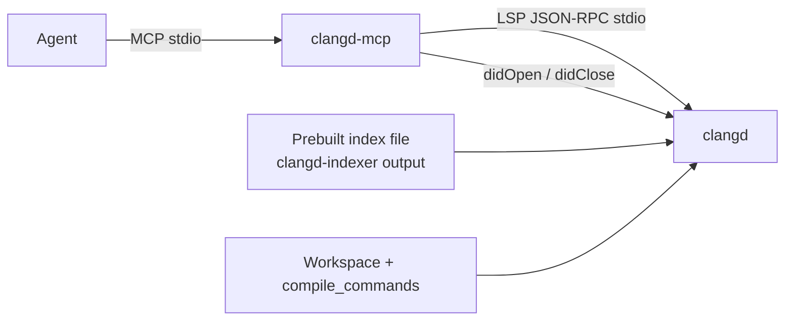

# clangd-mcp plan

An MCP server that is a **thin interface from agents to clangd**. Callers pass
an already-built clangd index file (`clangd-indexer` output). The server
starts clangd against that file and exposes clangd's semantic queries as MCP
tools.

This package does not implement review workflows, diff parsing, blast-radius
reports, or index-file comparison. Those are consumers of the tools, not
features of the server.

---

## Goal

Give agents the same project-wide C++ intelligence an editor gets from clangd
— symbols, xrefs, hover, call/type hierarchy — over MCP, backed by a
**prebuilt static index**.

The server:

1. Starts (or later: talks to) clangd with `--index-file=<path>`.
2. Opens workspace files on demand (`didOpen`) for position-based requests.
3. Forwards clangd LSP / clangd-extension requests as MCP tools.
4. Returns compact, structured JSON (capped lists, workspace-relative paths).

It does **not** build the index, parse `.idx`/RIFF shards, or interpret git
diffs.

---

## Why this exists

Agents default to grep. That misses overloads, templates, macros, virtual
dispatch, and cross-TU references. clangd already answers those from an
index. This MCP is the socket.

Typical *callers* (not built in):

- A review agent that already has a diff and wants callers / implementations
  for symbols it resolved itself.
- A pipeline that diffs two index files elsewhere, then looks up the
  surviving names/locations here.
- Interactive exploration: "what is this type?", "who calls this?"

---

## Constraints

- **Index file is the input.** Startup takes a path to a static index
  produced by `clangd-indexer` (RIFF or YAML). clangd is launched with
  `--index-file=... --background-index=false` so it does not rebuild or
  incrementally update the project.
- **One clangd, one index.** Comparing two indexes is out of process. Run
  two MCP instances if you need before/after.
- **Sources must match the index.** Static indexes store absolute paths.
  The workspace tree clangd sees has to line up with how the index was
  built.
- **No LSP lookup by SymbolID / USR.** clangd can do `SymbolIndex::lookup`
  internally; LSP only has fuzzy `workspace/symbol` and position-based
  requests. Callers join by **name and/or `file:line:col`**. Tools still
  return `usr` and clangd `id` from `textDocument/symbolInfo` when a
  position is available.
- **AST-backed vs index-backed.** Project-wide search, references, and
  call hierarchy come from the static index. Hover, document symbols,
  diagnostics, and AST still need `didOpen` plus a compile command for
  that file. A `compile_commands.json` (or equivalent) remains required
  for those tools; index-only tools can still answer without opening
  every TU.

---

## Non-goals

- Review composites (`review_context`, hunk mapping, blast-radius ranking,
  "which files should a human open", test-path heuristics).
- Parsing unified diffs or git patches.
- Parsing or diffing clangd index files.
- Building or refreshing the index (`clangd-indexer` stays a separate step).
- Completion, rename, apply-edit, format.
- Whole-TU AST dumps.
- Remote-index / clangd-index-server protocol.
- Attaching to an already-running editor clangd (v1 spawns its own process).

---

## Architecture



Layers:

1. **Process manager** — spawn clangd with the index file and workspace
   root. Restart on crash. Surface ready/health. Whether the clangd
   binary is bundled in this package or taken from `PATH` is an open
   question (see below).
2. **LSP client** — Content-Length JSON-RPC, request IDs, notifications
   (`publishDiagnostics`, `clangd.fileStatus`).
3. **Document session** — for position-based calls: read the file,
   `didOpen`, wait until `fileStatus` is idle (or timeout). Close idle
   files so ASTs do not accumulate.
4. **Tool layer** — one MCP tool ≈ one clangd request (or a short
   prepare/resolve pair such as call hierarchy). No product logic on top.

Config (CLI and/or env, resolved at process start):

| Setting | Purpose |
| --- | --- |
| index file | **Required.** Passed as clangd `--index-file`. |
| workspace root | **Required.** LSP `rootUri`; sources must match the index. |
| clangd binary | Default `clangd` on `PATH`, unless we vendor one. |
| compile-commands dir | Optional override for `compilationDatabasePath`. |
| extra clangd args | Escape hatch. |
| result caps | `max_results` and similar, applied in the MCP. |

clangd argv (v1):

```text
clangd --index-file=<abs> --background-index=false --offset-encoding=utf-8
       [--compile-commands-dir=<dir>]
```

`--background-index=false` is important: the static index from
`clangd-indexer` is not the same format as `.cache/clangd/index` shards,
and we do not want clangd to start a full project reindex on first
`didOpen`.

### Language

**TypeScript + official `@modelcontextprotocol/sdk`**, Node 20+, stdio
transport. Easy Cursor / Claude Code config. The tool list does not
depend on the language; Python is fine if preferred before Phase 1.

---

## Tools

Each tool is a direct clangd capability. Light presentation only: relative
paths, UTF-8 positions, default result caps, optional snippets. No
cross-tool "review report" assembly.

When a tool is position-based and clangd can resolve the token, include
`name`, `containerName`, `kind`, `usr`, `id` from `textDocument/symbolInfo`
where it is cheap (one extra request).

Default caps (overridable per call): `max_results=50`, `snippet_lines=0`,
`call_depth=1`.

| Tool | clangd / LSP | Notes |
| --- | --- | --- |
| `search_symbols` | `workspace/symbol` | Fuzzy name search; `::` scope hints as clangd implements them. |
| `get_symbol_info` | `textDocument/symbolInfo` | USR + clangd `id` at a position. |
| `get_hover` | `textDocument/hover` | Truncate long markdown. |
| `get_definition` | `textDocument/definition` | |
| `get_declaration` | `textDocument/declaration` | |
| `get_type_definition` | `textDocument/typeDefinition` | Useful for `auto` / typedefs. |
| `find_references` | `textDocument/references` | Enable `textDocument.references.container`. Cap the list; optional grouping by file is presentation, not analysis. |
| `find_implementations` | `textDocument/implementation` | |
| `get_callers` | `prepareCallHierarchy` + `incomingCalls` | `depth` default 1. |
| `get_callees` | `prepareCallHierarchy` + `outgoingCalls` | Same. |
| `get_type_hierarchy` | `prepareTypeHierarchy` + super/sub | `direction`: parents, children, both. |
| `get_file_symbols` | `textDocument/documentSymbol` | Outline of one file. |
| `get_diagnostics` | stored `publishDiagnostics` | Per opened file. |
| `switch_source_header` | `textDocument/switchSourceHeader` | |
| `get_ast` | `textDocument/ast` | Range required, depth-capped. |
| `clangd_status` | initialize + fileStatus | clangd version, index-file path, ready?, open files. |

Omitted: `completion`, `rename`, `codeAction`, `formatting`, `inlayHints`,
`semanticTokens`, `inactiveRegions` as tools, `$/memoryUsage` (maybe a
verbose flag on `clangd_status` later).

---

## Example caller flow

A review agent (implemented elsewhere) has a diff and a list of
`file:line:col` or symbol names:

1. `search_symbols` or `get_file_symbols` to bind a name/position.
2. `get_definition` / `get_hover` / `get_symbol_info`.
3. `find_references` / `get_callers` / `find_implementations` /
   `get_type_hierarchy` as needed.
4. The agent (or another tool) decides what is relevant to the review.

An index-diff job (also elsewhere) emits added/removed/changed symbols
with names and locations; it uses the same primitives against this MCP
pointed at the "after" index file.

---

## Operational details

**Readiness.** Wait for LSP initialize, then for the static index to
finish loading (`--index-file` is applied asynchronously inside clangd).
`clangd_status` should say when index-backed tools are safe. For an
opened file, wait on `textDocument/clangd.fileStatus` before
position-based AST requests.

**didOpen.** Only files the tool needs. Close after idle. Do not open the
whole project.

**Compile database.** Fail clearly if a position-based/AST tool is called
and clangd has no compile command for that file. Index-only tools should
still work.

**Result hygiene.** Cap lists. Do not dump thousands of reference
locations unless the caller raises `max_results`.

**Concurrency.** One clangd stdio socket: serialize LSP requests; MCP
tool calls queue.

**Paths.** Tool arguments that are files must resolve under the workspace
root (after realpath). The index file may live outside the workspace
(artifact store, regression output).

**Security.** No arbitrary shell. Subprocess is clangd only.

---

## Implementation phases

### Phase 0 — this document

Agree that the server is a clangd interface, not a review product.

### Phase 1 — skeleton

- Package, stdio MCP server.
- clangd spawn with required `--index-file` and `--background-index=false`.
- Document session (`didOpen` / `didClose` / fileStatus wait).
- `clangd_status`, `search_symbols`, `get_hover`, `get_definition`,
  `find_references`.

### Phase 2 — remaining clangd tools

- Declaration, type definition, symbol info, document symbols.
- Implementations, callers, callees, type hierarchy.
- Diagnostics, switch header, bounded AST.

### Phase 3 — polish

- Caps, optional snippets, relative paths, `usr`/`id` on resolved
  positions.
- Unit tests against a mocked LSP; one integration test with a tiny C++
  fixture + a `clangd-indexer` index file (if clangd is available).
- README: how to point Cursor / Claude Code at the server.

---

## Open questions

1. **TypeScript vs Python** — plan assumes TypeScript.
2. **Bundle clangd or not?** Ship a clangd (and maybe `clangd-indexer`)
   next to the MCP vs require a compatible binary on `PATH`. Bundling
   makes "index file in, answers out" more hermetic; it also means
   versioning clangd with this repo and dealing with platform binaries.
   v1 can require `PATH` and leave vendoring as a follow-up.
3. **Index-only mode vs always needing a workspace checkout.** The static
   index has symbol locations, but many LSP methods still open the file.
   Assume a matching source tree for v1.
4. **Lookup-by-USR** would need a clangd-side extension. Out of scope
   unless name+location collisions become real.

---

## What success looks like

An agent can point this server at a workspace and a `clangd-indexer`
file and then, through MCP tools only:

- search project symbols
- resolve definition / declaration / type / hover at a position
- list references, callers, callees, implementations, bases/derived
- outline a file and read its diagnostics

…without this repo knowing what a review, a diff, or a second index is.
